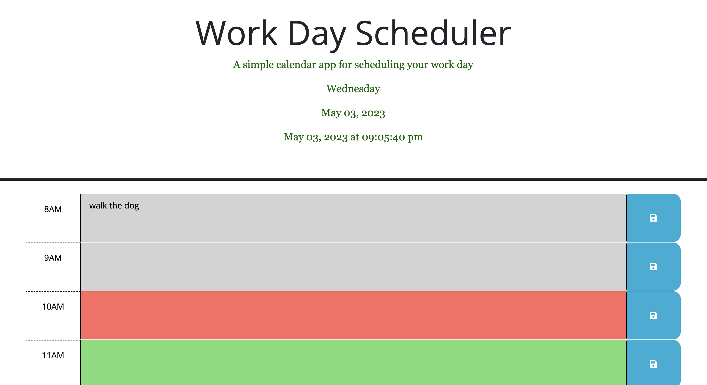

# Work-Day-Scheduler

## Description

This is a simple work day scheduler app.  This was created using day.js, javascrip, css and JQuery.  The goal was to dispaly the current day, date and time at the top.  I was then to use javascript and jQuery to make the app more dynamtic by color blocking the hours based on the acutal current time.  I also used localstorage to save the events that are typed in by the user even if the page had been refreshed.  

## Installation

Work Day Scheduler URL:

## Usage
The time blocks are broken up by the hour between 8am -5pm.  The user is able to type in events or todos for each hour that will save on the page once the save icon is clicked.  The hour blocks will also be color coded dependent on the current time.  Green for the future, red for the current hour and grey for the past.  
 

## License

No License